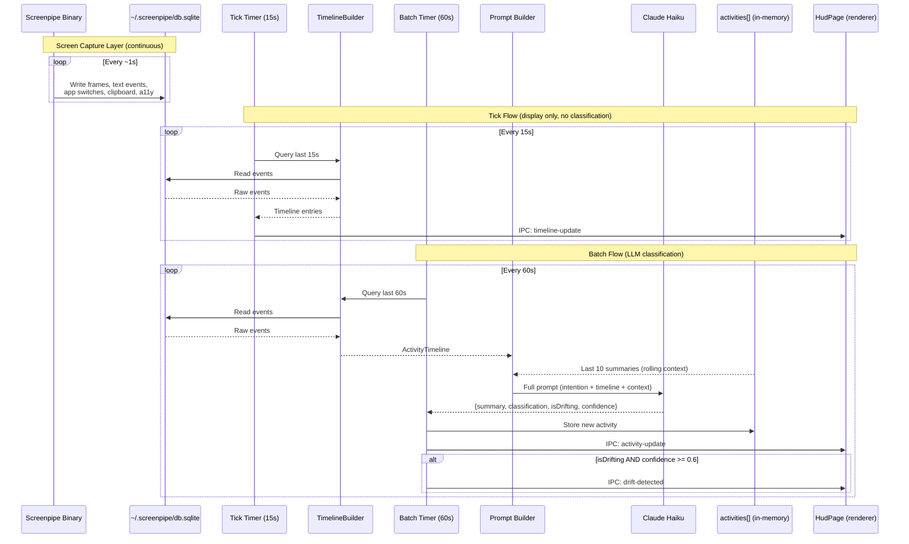
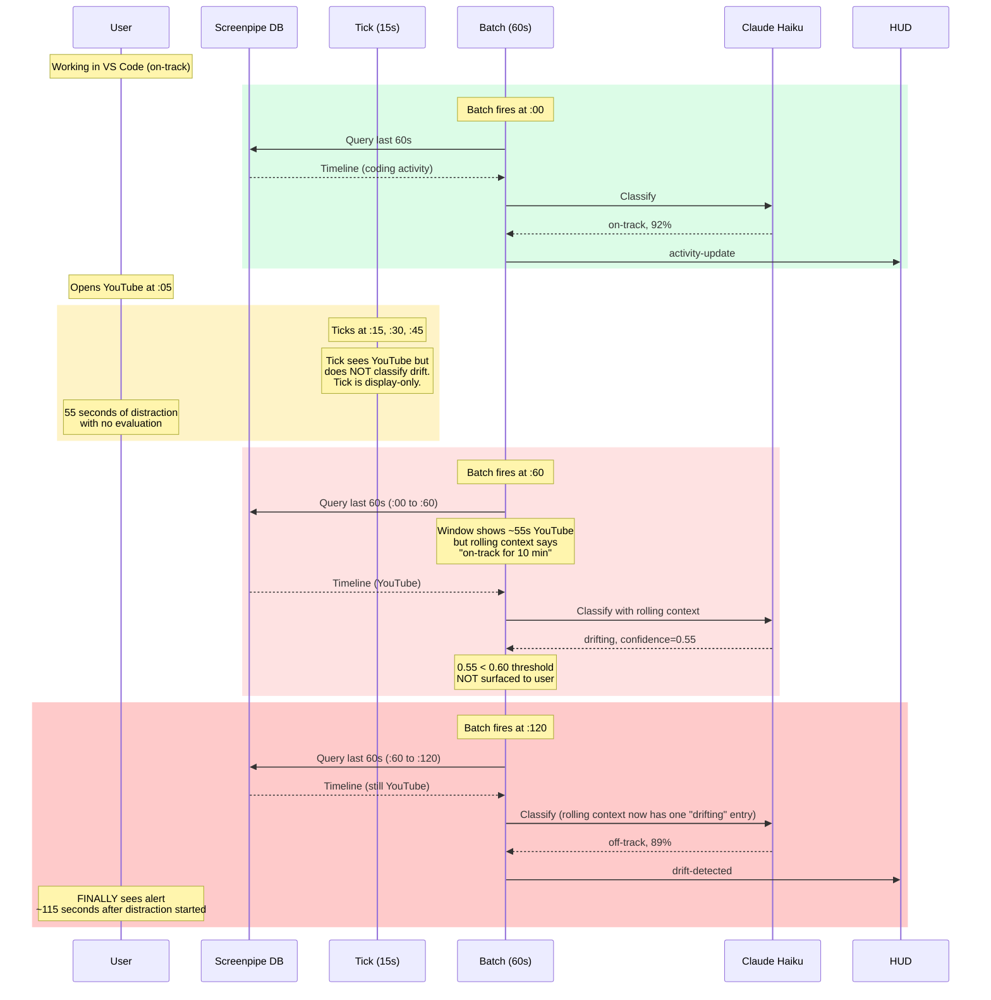
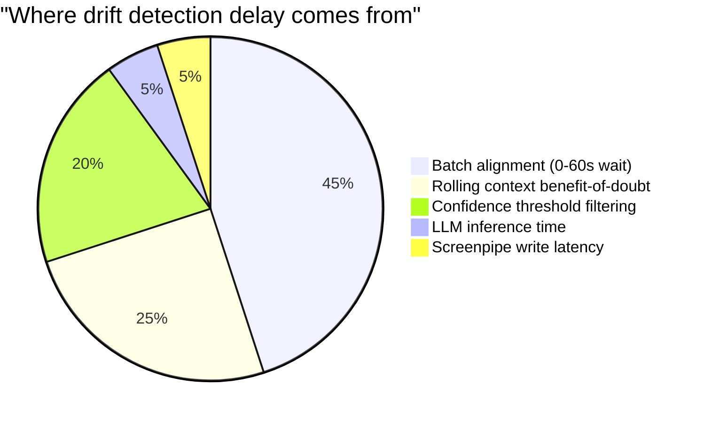
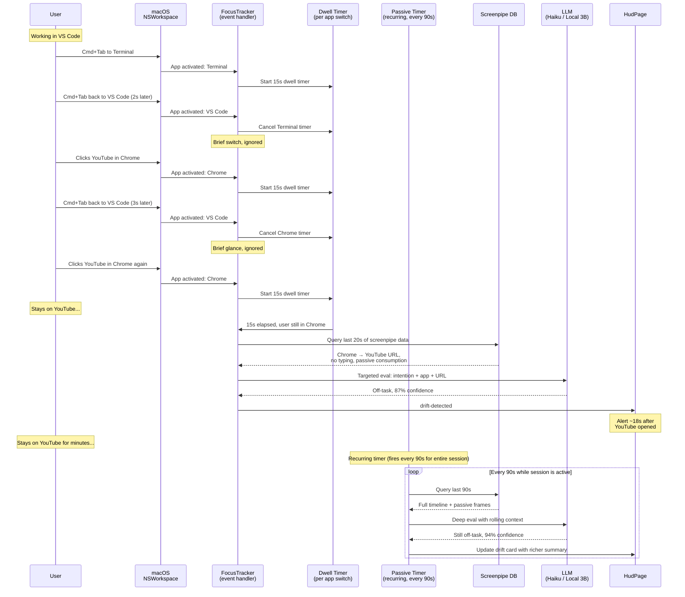
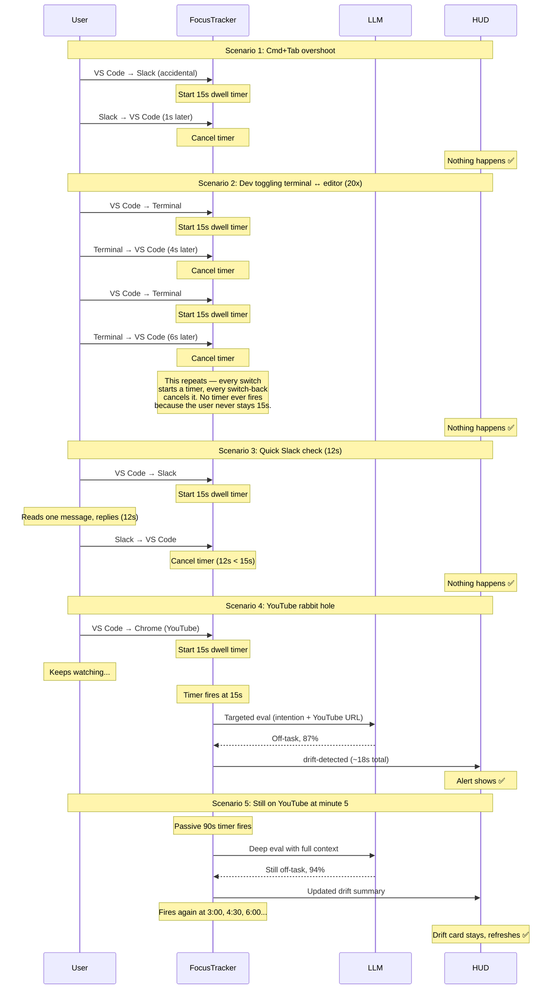
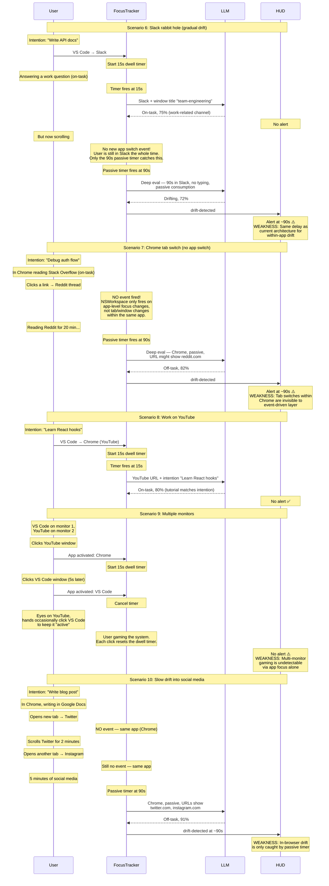

# Drift Detection Architecture Analysis

**Date:** 2026-05-04
**Context:** Investigating why drift detection feels delayed or sometimes doesn't fire at all.

## Current Architecture

### Data Pipeline



### Key Timing Constants

| Stage | Interval | Source | Purpose |
|-------|----------|--------|---------|
| Screenpipe capture | ~1s | screenpipe binary | Records screen frames to SQLite |
| Tick | 15s (`DEFAULT_TICK_MS`) | focus-tracker.ts | Polls screenpipe DB, updates debug dashboard |
| Batch | 60s (`DEFAULT_BATCH_MS`) | focus-tracker.ts | Queries last 60s, calls LLM, classifies drift |
| LLM inference | ~1-3s | Anthropic API | Haiku response time |
| Drift threshold | confidence >= 0.6 | focus-tracker.ts:260 | Below this, drift is detected but NOT surfaced to user |

### Batch Window Behavior

The batch timer runs every 60 seconds. Each batch queries `now - 60s` to `now`. The windows are **disjoint and non-overlapping** — there's no continuity between batches except the rolling context (last 10 summaries fed into the prompt via IDE-140).

## Why Drift Detection Feels Delayed or Absent

### The Delay Timeline



### Root Causes (ranked by impact)



#### 1. Batch Alignment (0-60s delay)

The batch fires on a fixed interval. If you open YouTube at second :05 of a batch window, the distraction won't be evaluated until second :60. **Average expected delay: ~32 seconds** (half the batch interval + inference time). Worst case: 60 seconds.

#### 2. The 60s Window Dilutes Short Distractions

If you open Twitter for 15 seconds within a 60-second window where you were coding for 45 seconds, the timeline shows 75% on-task activity. The prompt says "be proportionate" and "false positives are worse than false negatives." The LLM correctly sees a mostly-focused window and classifies it as on-track.

**Brief distractions under ~20s are almost guaranteed to be missed** within a 60s window.

#### 3. Rolling Context Delays First Detection

IDE-140's rolling context feeds the last 10 summaries into the prompt with a note: "A user who has been on-track and briefly switches apps may be pivoting tactically, not drifting." If you've been on-track for 10 minutes, the LLM gives benefit of the doubt on the **first batch** of a genuine distraction. Real drift often isn't flagged until the **second batch** (~2 minutes into the distraction).

#### 4. Confidence Threshold Gates the Alert

Even when the LLM classifies `isDrifting: true`, the alert only surfaces if `confidence >= 0.6` (focus-tracker.ts:260). A borderline distraction might get `isDrifting: true, confidence: 0.45` — detected internally but never shown to the user.

#### 5. Screenpipe Data is Sparse for Passive Consumption

The most common distraction pattern — **passive consumption** (watching videos, scrolling feeds) — generates the weakest signal:

- **Text events** only fire when typing. Watching YouTube = zero text events.
- **App switches** only fire on focus changes. Staying in one tab = one event.
- **Passive frames** (screen OCR) are noisy and may not capture video content reliably.

The LLM might see just: `[Chrome — YouTube] (passive consumption — no typing detected)` — a thin signal to classify.

#### 6. Empty Batches Are Skipped Entirely

If `timeline.entries.length === 0` (no screenpipe data in the window), the batch is skipped without calling the LLM (focus-tracker.ts:176-179). Those 60 seconds are unmonitored.

## The Core Tension

Short intervals (15-30s) catch distractions faster but produce more false positives and give the LLM less context to distinguish drift from tactical pivots.

Long intervals (60s+) reduce false positives and give better context, but distractions go unnoticed for up to a minute, and brief distractions are diluted.

The prompt is tuned heavily toward **false-positive avoidance** (rule 4: "when uncertain, classify as NOT drifting"). This preserves user trust but means the system errs on the side of silence.

## Feasibility: Event-Driven Detection

### Research findings

**Can we hook into real-time app focus events instead of polling?**

Yes. There are two viable approaches on macOS:

**1. `systemPreferences.subscribeWorkspaceNotification` (Electron native)**

Electron exposes macOS `NSWorkspace` notifications. We can subscribe to `NSWorkspaceDidActivateApplicationNotification` to get **instant** callbacks when any app gains focus — no polling needed. This fires on every Cmd+Tab, Dock click, or app launch.

```ts
// Fires instantly on every app focus change — no delay
systemPreferences.subscribeWorkspaceNotification(
  'NSWorkspaceDidActivateApplicationNotification',
  (event, userInfo) => {
    const appName = userInfo['NSWorkspaceApplicationKey']?.localizedName;
    // appName is now the newly-focused app
  }
);
```

**2. Screenpipe `ui_events` table with high-frequency poll**

The screenpipe DB records `app_switch` events in `ui_events`. We could poll just this one lightweight query every 2-3 seconds instead of the full timeline query every 15s. The query is tiny — single indexed column filter.

**Option 1 is clearly better** — zero latency, native OS event, no polling at all. The screenpipe DB polling remains useful for the deep tier (typed text, URLs, passive frames) but app focus changes should come from the OS directly.

**What about passive consumption (YouTube watching)?**

This is the key challenge. An event-driven system reacts to **user actions** — but watching a YouTube video is the *absence* of action. The user switches to Chrome/YouTube once, then does nothing for 20 minutes. There's only one event (the app switch), then silence.

This means: **event-driven detection catches the *start* of a distraction instantly, but cannot distinguish "still watching YouTube" from "walked away from the computer" without a background timer.**

The solution is a hybrid: events detect transitions, a background timer detects persistence.

### Handling false positives from rapid switching

The concern about Cmd+Tab flickering and dev workflows (terminal ↔ editor) is real. The fix is a **dwell time filter**: don't react to an app switch until the user has *stayed* in the new app for a minimum duration.

- **< 3 seconds**: Ignore entirely. This is Cmd+Tab overshoot, accidental switches, quick glances.
- **3-15 seconds**: Note it but don't classify. Could be a quick reference check.
- **> 15 seconds**: The user has settled into this app. Now evaluate.

Every dwell timer is cancelled if the user switches away before it fires. No user configuration needed.

## Proposed Architecture: Event-Driven + Passive Timer Hybrid



### Scenario pressure tests



### Harder scenarios — where does this break?



### Weakness summary

| Weakness | Description | Impact | Mitigation |
|----------|-------------|--------|------------|
| **Within-app drift** | User stays in Slack but shifts from work channel to #random. No app switch event fires. | High — very common pattern | Only the 90s passive timer catches this. Could shorten passive cadence to 45s when in comms apps. |
| **Browser tab switches** | User goes from Stack Overflow to Reddit within Chrome. NSWorkspace doesn't fire — it's the same app. | High — most distractions happen in the browser | Screenpipe passive frames capture URLs. The passive timer sees the URL change. Could add a fast URL-change detector polling screenpipe's frames table every 10-15s (tiny query). |
| **Multi-monitor gaming** | User keeps clicking the "right" app to reset dwell timers while watching something on another screen. | Low — requires deliberate effort to fool the system | Essentially unsolvable via app focus. Would need gaze tracking or screen content analysis. Not worth solving now. |
| **Gradual tab-hopping** | User drifts from work tab → tangentially related → clearly off-task over 5-10 minutes, all within Chrome. | Medium — common but slow | The 90s passive timer eventually catches it via URL analysis. The delay is inherent to within-app drift. |
| **15s dwell false negative** | User checks Twitter for 14 seconds — just under the threshold. Genuinely distracted but not flagged. | Low — 14s distractions are self-correcting | Could track cumulative time in flagged states: 5x 14-second Twitter checks = 70s total, trigger eval even though no single dwell exceeded 15s. |

### Key design decisions (revised)

**App switches come from macOS, not polling.** `systemPreferences.subscribeWorkspaceNotification('NSWorkspaceDidActivateApplicationNotification')` gives instant, zero-latency app focus events. No screenpipe polling needed for this signal.

**Dwell time filter (15s) prevents false positives.** Every app switch starts a timer. Every subsequent switch cancels the previous timer. Only when the user *stays* for 15s does evaluation trigger. This naturally handles Cmd+Tab overshoot, dev toggling, and quick reference checks — no app allowlists or session sets needed.

**Targeted LLM eval on dwell.** When the dwell timer fires, query only the last ~20s of screenpipe data for context (URL, window title, typed text). The prompt is short and focused: "User's intention is X. They've been in [app + URL] for 15 seconds. Is this on-task?" Faster and cheaper than the current full-window batch.

**Recurring passive timer (90s) handles everything the event layer can't.** Fires every 90s for the entire session. Catches: within-app drift (Slack #random), browser tab changes, sustained passive consumption, and gradual drift. Uses the full prompt with rolling context. This is essentially the current batch timer but at a longer cadence since fast detection is handled by events.

**No session app set.** Every app switch is treated equally — the dwell timer is the only filter. This is simpler, has no user configuration, and avoids the problem of a "safe" app auto-learning a distraction app.

### The honest assessment

This architecture dramatically improves detection for **app-level distractions** (YouTube, Twitter app, gaming) — from ~115s to ~18s. But it has the same ~90s delay as today for **within-app distractions** (browser tab changes, Slack channel drift). Those within-app cases are arguably the more common pattern for knowledge workers who live in the browser.

The browser tab problem is solvable by adding a lightweight URL-change poll (query screenpipe's `frames` table for `browser_url` every 10-15s — a tiny indexed query). But it adds back polling for one specific case. Worth doing, but it's a separate enhancement.

## Open Questions

- Does the 15-second dwell time feel right, or should it be shorter (10s) or longer (20s)?
- Can the local 3B model (IDE-146) handle the quick targeted eval fast enough? (~1-2s on a short prompt)
- Should the passive timer cadence adapt? (e.g., 90s when on-track, 45s when in a flagged app)
- Should we add a fast URL-change detector for browsers specifically? (Poll `frames.browser_url` every 10s)
- How do we handle the "work YouTube" case? (The LLM should handle this via intention matching, but we should test it)
- Should we track cumulative dwell in flagged states? (5x 14-second Twitter checks = 70s total)
- IDE-149 (batch interval experiment) data may inform the passive timer cadence
