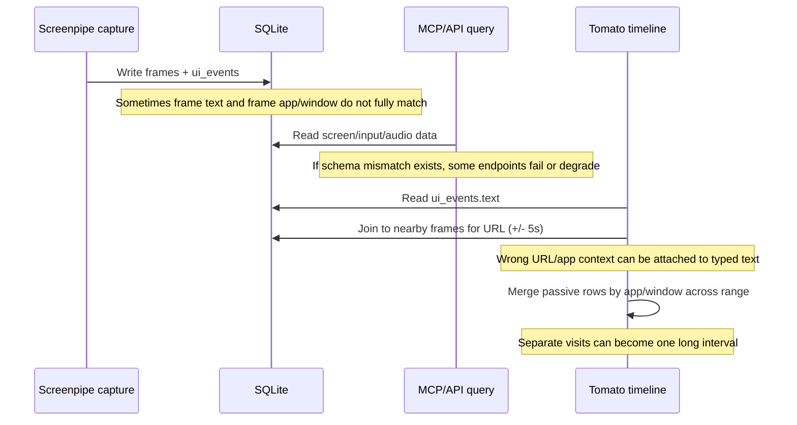
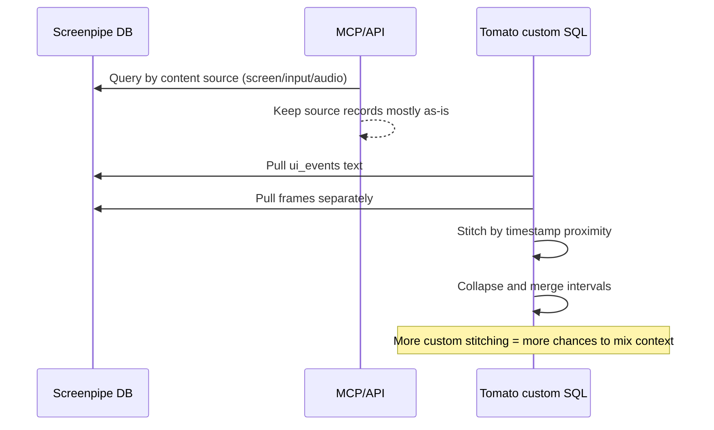

# Screenpipe vs Tomato Timeline Integrity (Phase A Re-test)

**Date:** 2026-09-02  
**Scope:** Real comparison of MCP data vs Tomato data for the same window: **12:00pm–2:20pm ET**.  
**Goal:** Explain why app/window/text/timestamps go out of sync, in plain language, and propose a focused plan.

---

## Quick answer

You were right to question the earlier report and ask for a real comparison.

After rerunning with the same time range on both sides, the core findings still hold. The biggest change is that we also found and fixed a **live DB compatibility problem** that was breaking MCP/search behavior.

---

## What I tested (same window on both sides)

Window used: **2026-09-02 12:00:00 ET → 14:20:00 ET**

### MCP-side tests

- `keyword-search` for `Discord` (ET window and UTC-equivalent window)
- `search-content` with `content_type=all` + `q="switz's server"`
- `search-content` with `content_type=input` + `q="test"`
- `activity-summary` in 3 formats:
  - ET timestamps
  - UTC timestamps
  - relative (`2h ago` → `now`)

### Tomato-side (SQL mirror of current code)

- Counts and samples using the same time window
- Text-event query shape matching `getTextEvents`
- Passive frame query shape matching `getPassiveFrames`
- Focusing on rows around your reported mismatch time (~12:55 ET)

---

## Environment facts (important)

- Running Screenpipe recorder process:
  - `/Users/oliverswitzer/Applications/ScreenpipeCLI.app/Contents/MacOS/screenpipe record`
  - version: **0.3.288**
- MCP process used by tools in this session:
  - `bunx ... screenpipe-mcp@latest`
  - version at runtime: **0.19.4**
- Also present locally:
  - `~/.screenpipe/mcp` package: **0.18.15**
  - `~/workspace/screenpipe/packages/screenpipe-mcp`: **0.18.10** (mit-license-commit branch)
- DB migration history in `~/.screenpipe/db.sqlite` includes versions up to **202607...**, newer than the migrations present in the open `mit-license-commit` source tree.

So yes: this machine has had mixed versions over time.

---

## DB compatibility mismatch (resolved during this run)

### What broke

We saw repeated runtime errors:

- `no such table: ocr_text`
- affecting both search and event-driven capture paths.

### What I did

I created a compatibility `ocr_text` table (with expected columns + indexes) in your live DB so current runtime queries stop failing.

### Verification

- Before fix: `keyword-search` failed with 500 (`no such table: ocr_text`).
- After fix: `keyword-search` returned results immediately (including frame `375172`).
- Log check: last `no such table: ocr_text` error appears before the fix time; none after.

> Note: this is a practical local repair, not the final architecture answer.

---

## Phase A results (real MCP vs Tomato comparison)

## MCP-side observed data (12:00–2:20 ET)

1. `keyword-search("Discord")` worked and returned frames including:
   - `375173` (Discord-like text)
   - `375172` (Discord metadata but Slack-like text blob)
2. ET and UTC versions of the same query returned the **same frames** (so not a timezone parsing issue for this query path).
3. `search-content` with `q="switz's server"` returned Chrome/Discord accessibility rows in the expected time window.
4. `search-content` with `content_type=input` and `q="test"` returned hits (`7/7`; narrow window `test test` gave `1/1`).
5. `activity-summary` returned **0 active minutes / 0 frames** in ET, UTC, and relative formats.

## Tomato-side observed data (same window)

- `frames` in window: **1025**
- `ui_events` text rows (len > 3): **454**
- `ui_events` text app mix: overwhelmingly **Slack**
- `frames` app mix: **Chrome, Zed, iTerm2, Messages, Slack, IntelliJ** (multi-app)

From Tomato-style text query samples around 12:53–12:56 ET:

- multiple rows show `app=Slack` but `browser_url=discord.com/...`
- count in this window: **15 Slack text rows carrying Discord URL**

`ui_events` example:

- `test test` typed at `16:54:06Z` shows `app=Slack`
- nearest frames at that time show `app=Google Chrome`, Discord window + Discord URL.

Passive grouping check:

- `passive_raw` rows: **1025**
- after `GROUP BY content_hash`: **989**
- several app/window groups have large internal gaps (example: 4317s) but are treated as one block.

---

## Top 4 integrity issues (plain language)

## 1) Version/schema mismatch can break capture + MCP search

When the running Screenpipe binary and DB schema disagree, key queries fail (`ocr_text` missing), and then both timeline/capture quality and MCP behavior degrade.

**Why this matters:** any higher-level analysis becomes unreliable if the recorder/search layer itself is broken.

---

## 2) Some frame rows are already mixed upstream (before Tomato touches them)

Frame `375172` itself has:

- app/window metadata: Chrome + Discord tab
- text payload: Slack-heavy content

**Why this matters:** this is not only a Tomato bug. Some mismatches are already present in captured frame rows.

---

## 3) Tomato’s custom text join can attach the wrong URL/context

Tomato joins text events to nearby frames only by time (±5s), then borrows `browser_url`.
That can produce rows like: Slack typing + Discord URL.

**Why this matters:** this directly creates the app/text/context mismatch you’re seeing in timeline entries.

---

## 4) Timestamp spans can be stretched by passive grouping logic

Two Tomato behaviors combine here:

- `GROUP BY content_hash` removes repeated frames (lossy)
- grouping by app/window across the whole range merges separate visits into one block

This can create long blocks where the `timestampEnd` suggests continuous activity even with big gaps.

(Also: exact boundary checks with `...Z` strings can miss rows in some cases; numeric time comparisons are safer.)

---

## Why this happened (simple flow)

---

## MCP vs Tomato interpretation difference

---

## New plan (focused, efficient)

This plan is intentionally limited to the most important fixes.

## Step 0 — Lock versions and add startup safety checks (P0)

1. Pin one known-good version set for:
   - Screenpipe recorder binary
   - MCP package
   - DB schema expectation
2. Add a startup check that verifies required tables/columns.
3. If mismatch is found, fail clearly with action steps (don’t run half-broken).

**Why first:** prevents silent bad data.

---

## Step 1 — Fix Tomato query logic for typed text and context (P0)

1. Stop joining text events to frames by time-only ±5s.
2. Keep typed text anchored to its own `ui_events` row (`timestamp`, `app_name`, `window_title`).
3. Only attach `browser_url` when app+window also match (or don’t attach at all if uncertain).
4. Use numeric time filtering (`julianday`/epoch) in all timeline queries.

**Why:** preserves typed-text feature while removing the biggest source of false context.

---

## Step 2 — Fix passive interval construction (P1)

1. Remove lossy `GROUP BY content_hash` for timeline assembly.
2. Build intervals by contiguous runs with a gap threshold.
3. Do not merge separate visits just because app/window names match.

**Why:** gives honest start/end times and avoids fake long blocks.

---

## Step 3 — Upstream Screenpipe improvements (optional but high value)

If you want to patch Screenpipe (Rust) for stronger guarantees:

1. Add a shared capture/focus ID linking frame + input event written in same cycle.
2. Store explicit “focus snapshot” fields on input events (captured at write time).
3. Add API/version handshake so MCP can warn on backend contract mismatch.

**Why:** typed text in active-window context becomes much more trustworthy at the source.

---

## Step 4 — Verification harness (must-have)

Add one repeatable test over a fixed window that checks:

- typed event app/window vs attached URL consistency
- interval gap correctness
- boundary timestamp inclusion
- side-by-side diff between Tomato output and MCP output

This is your guardrail against regressions.

---

## Important context to preserve (your original reason for custom joins)

Your earlier custom aggregation made sense for MVP: Screenpipe typed text capture/context used to be weaker.

What changed now:

- in this run, MCP/input search does return typed text hits in the same window,
- so we can likely simplify Tomato logic and still keep the typed-text feature,
- but we should verify quality with the harness before removing custom behavior fully.

---

## Suggested next action

Implement **Step 1 + Step 2** behind a feature flag and run the Phase A harness on today’s window plus 2–3 historical windows. If you want, I can implement that next in `src/main/screenpipe-db.ts` and `src/main/timeline-builder.ts` with tests.
